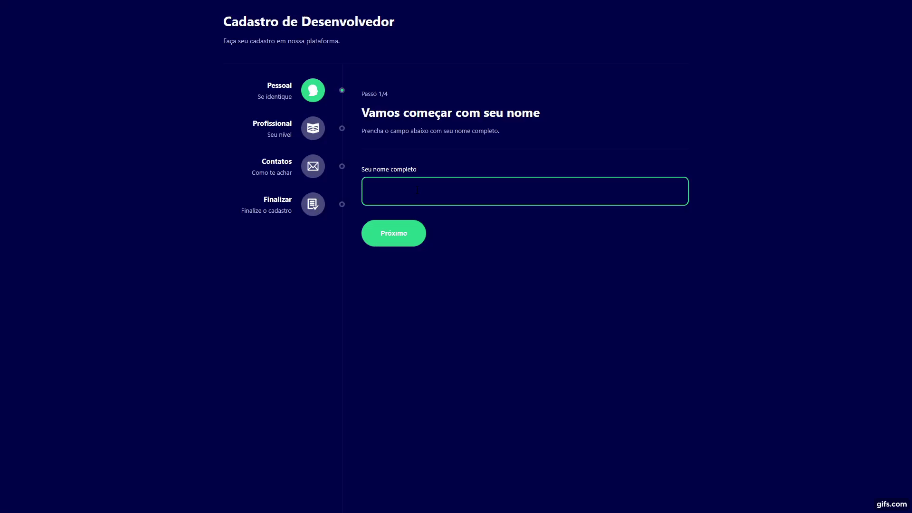

# Formulário Multi-Etapas (Desafio B7Web 5 Em 5)
# Sobre o projeto

### Acesse: https://gsmultiform.netlify.app/
O projeto é o quinto do Desafio 5 em 5 React com Typescript proposto pela <a href="https://b7web.com.br/fullstack/">B7Web</a>. O site é um formulário multi-etapas, utilizando as principais funcionalidades do ReactJS. Implementei uma quarta tela, onde o usuário pode confirmar seus dados e finalizar o cadastro e adicionei responsividade ao projeto. 

## Demonstração 💻

## 🚀 Tecnologias Usadas

- ✔️ [React](https://pt-br.reactjs.org/)

- ✔️ [Styled-components](https://styled-components.com/docs/basics#installation)

- ✔️ [TypeScript](https://www.typescriptlang.org/)

